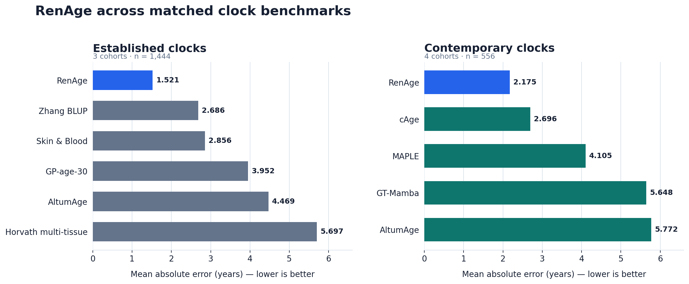
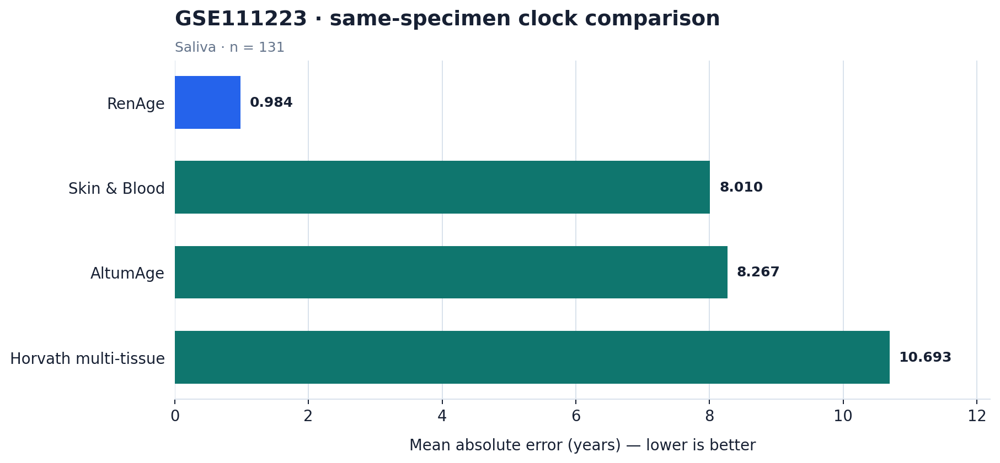

# RenAge: An Accurate Pan-Tissue Epigenetic Clock

<p align="center">
  <strong>Precise chronological-age inference from DNA methylation across tissues</strong>
</p>

<p align="center">
  
  
  
  
  
  
</p>

<p align="center">
  <a href="#performance">Performance</a> ·
  <a href="#quick-start">Quick start</a> ·
  <a href="#input-data">Input data</a> ·
  <a href="#scope-and-limitations">Limitations</a>
</p>

RenAge is a pan-tissue epigenetic clock for predicting chronological age from
DNA methylation beta values. It combines strong accuracy in matched clock
benchmarks with broad tissue applicability across blood, buccal, saliva,
skin/epidermis, and brain-derived methylation profiles.

## At a glance

| **Accuracy** | **Pan-tissue scope** | **Ready for inference** |
|:---|:---|:---|
| **1.521-year MAE** across three matched blood cohorts | Evidence spans blood, buccal, saliva, skin/epidermis, and brain-derived profiles | One command on Linux or macOS |
| Lowest MAE among the established clocks compared | Designed for tissue-diverse methylation inputs | CSV, TSV, TXT, and optional Parquet input |

> **Benchmark highlight:** RenAge achieved the lowest MAE in both the
> established-clock comparison (1.521 years) and the contemporary-clock
> comparison (2.175 years).

<a id="performance"></a>

## Performance

Mean absolute error (MAE) and root mean squared error (RMSE) are reported in
years; lower is better. Every comparison within a table uses the same
specimens, and results from different benchmark sets are kept separate.



### Established clocks

Equal-cohort results across 1,444 blood specimens. The three cohort IDs are
**GSE84727**, **GSE220622**, and **GSE295450**.

| Clock | MAE (years) |
|---|---:|
| **RenAge** | **1.521** |
| Zhang BLUP | 2.686 |
| Skin & Blood | 2.856 |
| GP-age-30 | 3.952 |
| AltumAge | 4.469 |
| Horvath multi-tissue | 5.697 |

### Contemporary clocks

Identical-specimen, equal-cohort results across four blood cohorts comprising
556 specimens:

| Clock | MAE (years) |
|---|---:|
| **RenAge** | **2.175** |
| cAge | 2.696 |
| MAPLE | 4.105 |
| GT-Mamba | 5.648 |
| AltumAge | 5.772 |

DeepStrataAge could be evaluated in one exact-age cohort. In that cohort
(`n=388`), MAE was 1.287 years for RenAge and 1.959 years for DeepStrataAge.

### GSE111223 saliva cohort

All clocks below were evaluated on the same 131 saliva specimens. RenAge is
shown against clocks with pan-tissue or skin-and-blood scope.



| Clock | Intended scope | MAE (years) | RMSE (years) | R² |
|---|---|---:|---:|---:|
| **RenAge** | Pan-tissue | **0.984** | **1.345** | **0.980** |
| Skin & Blood | Skin and blood | 8.010 | 9.061 | 0.082 |
| AltumAge | Pan-tissue | 8.267 | 9.984 | -0.115 |
| Horvath multi-tissue | Pan-tissue | 10.693 | 12.593 | -0.774 |

The frozen comparator implementations had 91.8%–96.0% CpG coverage on this
array; unavailable CpGs were handled by each implementation's built-in rule.
GSE111223 is reported separately and is not pooled with the benchmark
summaries above. Aggregate values used in the plots are available in
[`docs/metrics`](docs/metrics).

<a id="quick-start"></a>

## Quick start

### Requirements

- Linux or macOS
- Python 3.10 or newer
- CPU inference on both operating systems
- Optional NVIDIA CUDA on Linux or Apple Metal acceleration on macOS

### Install

```bash
git clone https://github.com/GuoqinRen/RenAge.git
cd RenAge
python3 -m venv .venv
source .venv/bin/activate
python -m pip install --upgrade pip
python -m pip install .
renage download
```

Install Parquet support when needed:

```bash
python -m pip install ".[parquet]"
```

### Predict age

> **Example input:** See
> [`examples/example_methylation_input.csv`](examples/example_methylation_input.csv)
> for a compact sample-by-CpG format reference with actual ages.

```bash
renage predict methylation.csv --output age_predictions.csv
```

To place predicted and actual ages side by side, identify the age field in the
input:

```bash
renage predict methylation_with_age.csv \
  --actual-age-field Age \
  --output age_comparison.csv
```

For sample-by-CpG input, `Age` is a column. For CpG-by-sample input, it is a
row label. The age field is included only for comparison and is never supplied
to the predictor.

The output columns are:

| Column | Meaning |
|---|---|
| `sample_id` | Input sample identifier |
| `predicted_age_years` | RenAge chronological-age prediction in years |
| `actual_age_years` | Supplied chronological age; present only with `--actual-age-field` |
| `missing_cpg_percentage` | Percentage of required CpGs absent or missing for the sample before imputation |

The default `auto` device uses CUDA when available, then Apple Metal when
available, and otherwise CPU. Run `renage predict --help` for all options.

<a id="input-data"></a>

## Input data

Input files may be CSV, TSV, TXT, or Parquet. Beta values must be within
`0` and `1`. Both common orientations are accepted:

- one sample per row and one CpG per column;
- one CpG per row and one sample per column.

The first identifier column should contain sample identifiers or CpG
identifiers, as appropriate. Orientation is detected automatically, or it can
be specified explicitly. CpG identifiers are matched without regard to letter
case. Duplicate sample or CpG identifiers are rejected.

A small sample-by-CpG file with actual ages is available at
[`examples/example_methylation_input.csv`](examples/example_methylation_input.csv).
It uses real RenAge CpG identifiers to illustrate the expected layout. Because
it is intentionally small, use it as a format reference rather than a complete
inference matrix. In a complete input, select its age column with
`--actual-age-field actual_age_years`.

The predictor reports panel coverage and missing-value counts. The prediction
CSV also shows the percentage of required CpGs absent or missing for each
sample before imputation. By default, at least 80% of required CpGs must be
present. Use a different threshold only when it is scientifically justified.

Explicit orientation and device selection are also available:

```bash
renage predict methylation.tsv \
  --orientation cpg-by-sample \
  --device cpu \
  --output age_predictions.csv \
  --qc-output age_predictions.qc.json
```

## Reproducibility and asset integrity

`renage download` retrieves the versioned inference bundle from the GitHub
release and verifies its SHA-256 checksum. The bundle contains a single frozen
ensemble artifact, required CpG identifiers, frozen reference values, and a
manifest with per-file checksums. By default it is stored under the operating
system's user cache directory. Set `RENAGE_ASSET_DIR` or pass `--assets` to use
another location.

## Scope and limitations

RenAge is intended for research use. It is not a medical device and must not be
used by itself for diagnosis, treatment decisions, or individual clinical
interpretation. Performance can vary with tissue, assay platform, preprocessing,
cohort composition, and CpG coverage. Predictions outside the represented age
and tissue ranges require particular caution.

## Citation

Citation metadata is provided in `CITATION.cff`. Publication citation details
can be added when available.

## License

RenAge is free for non-commercial use. Commercial use requires prior written
permission. For commercial applications or licensing, contact
[Guoqin Ren through GitHub](https://github.com/GuoqinRen). See
[`LICENSE`](LICENSE) for the full terms.
